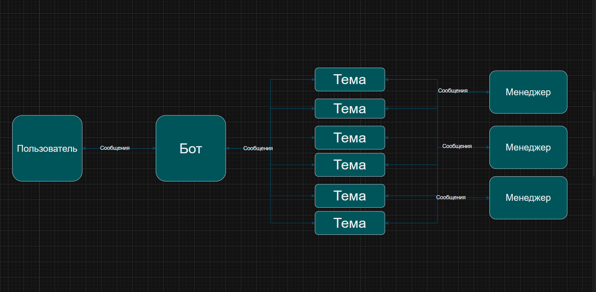

# TopicDesk Support Bot



A Laravel-based Telegram Support Bot that turns a Supergroup with Topics into a ticket system.


## Features

- 🎫 **Topic-based Tickets**: Creates a new Forum Topic for each user in the support group.
- 💬 **Two-way Communication**: Seamlessly forwards messages between User DM and Support Group Topic.
- 📸 **Media Support**: Handles Photos, Videos, Documents, and Voice messages using `copyMessage`.
- ⚡ **Queues**: Asynchronous processing with Laravel Jobs & Redis/Database.
- 🔒 **Commands**: `/start` welcome message and `/close` to archive tickets.
- 💅 **HTML Formatting**: Clean message layout.

## Requirements

- PHP 8.2+
- Laravel 12
- Database (MySQL/PostgreSQL/SQLite)
- Redis (Recommended for queues)

## Installation

1. Clone the repository.
```cmd
git clone https://github.com/rakhmatjonovm/TopicDesk.git
cd TopicDesk
```
2. Run `composer install`.
3. Copy `.env.example` to `.env` and configure database & Telegram credentials.
4. Run `php artisan migrate`.
5. Start worker: `php artisan queue:work`.

## Environment Variables

```dotenv
TELEGRAM_BOT_TOKEN=your_token
TELEGRAM_SECRET_TOKEN=your_secret
TELEGRAM_SUPPORT_GROUP_ID=-100xxxxxxx
TELEGRAM_WEBHOOK_URL=https://your-domain.com/api/telegram/webhook
```